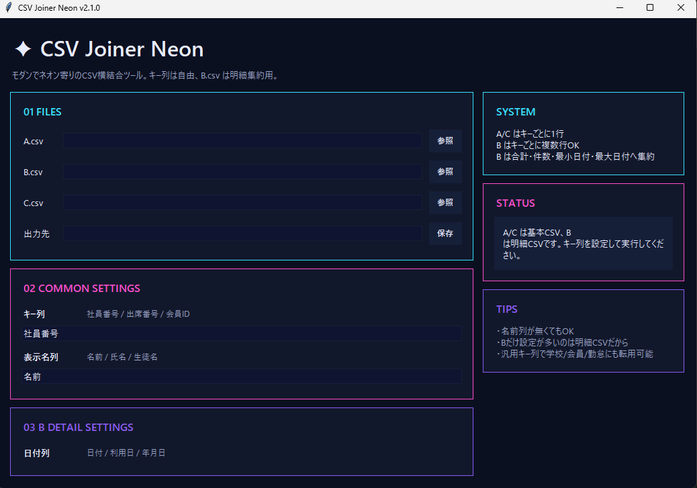

# ✨ CSV Joiner Neon


⚡ **Vibe Coding Project**

このツールは **バイブコーディング（Vibe Coding）** を取り入れて開発されています。
AIと対話しながら **設計 / CSV処理 / UI改善 / 汎用化** を反復的に試行錯誤して構築しました。

---

Flexible CSV horizontal join tool with detail aggregation.

キー列を自由に指定できる
**ネオンUIのCSV横結合ツール**です。

---

# 🖥 GUI



---

# 🚀 Features

✔ CSV横結合 (Horizontal Join)

✔ キー列自由指定

```
社員番号
出席番号
会員ID
ユーザーID
```

✔ B.csv 明細データ自動集約

```
明細金額合計
明細件数
最初日付
最終日付
```

✔ GUIアプリ
✔ CLI実行可能
✔ Windows EXE配布
✔ Neon / Modern UI

---

# 📦 Download (Windows)

Pythonが無くても使用できます。

EXEはこちら（GitHub Releases）

```
https://github.com/YOURNAME/CSVjoiner/releases
```

---

# 🧩 CSV Structure

このツールは **3種類のCSV** を扱います。

---

## A.csv（基本データ）

1キー = 1行

| ID   | 名前    | 勤務日数 |
| ---- | ----- | ---- |
| 1001 | ユーザーA | 20   |

---

## B.csv（明細データ）

1キー = 複数行

| ID   | 日付         | 金額  |
| ---- | ---------- | --- |
| 1001 | 2026-03-01 | 500 |
| 1001 | 2026-03-02 | 500 |

B.csv はキーごとに集約されます。

```
明細金額合計
明細件数
最初日付
最終日付
```

---

## C.csv（基本データ）

| ID   | 通勤経路  |
| ---- | ----- |
| 1001 | A駅→B駅 |

※サンプルデータはすべてダミーです。

---

# 🖥 GUI Usage

起動

```
python CSVjoiner.py
```

操作

```
1. A.csv選択
2. B.csv選択
3. C.csv選択
4. 出力先指定
5. キー列設定
6. 実行
```

---

# 💻 CLI Usage

```
python CSVjoiner.py A.csv B.csv C.csv merged.csv
```

列名指定

```
python CSVjoiner.py A.csv B.csv C.csv merged.csv ID 名前 日付 金額
```

---

# ⚙ Requirements

```
pandas
```

インストール

```
pip install pandas
```

---

# 🔧 Build EXE

```
pip install pyinstaller
```

```
pyinstaller --onefile --noconsole CSVjoiner.py
```

生成

```
dist/CSVjoiner.exe
```

---

# 🧪 Sample Data

```
sample/
 ├ A.csv
 ├ B.csv
 └ C.csv
```

サンプルCSVを使えばすぐに動作確認できます。

---

# 📁 Repository Structure

```
CSVjoiner
│
├ CSVjoiner.py
├ README.md
│
├ docs
│   └ screenshot.png
│
└ sample
    ├ A.csv
    ├ B.csv
    └ C.csv
```

EXEは **GitHub Releases** に配置しています。

---

# 🧠 Development

このツールは **Vibe Coding（バイブコーディング）** によって開発されています。

AIと対話しながら

* UI設計
* CSV処理ロジック
* エラーハンドリング
* ツール汎用化

を反復的に改善して構築しました。

**実用ツールとしての動作を最優先に設計しています。**

---

# 📜 License

MIT License
