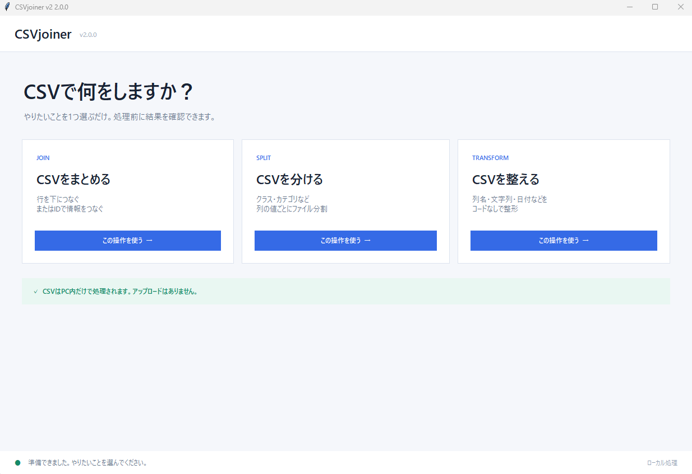

# CSVjoiner

CSVの **結合・分割・整形** を、コードを書かずに扱えるWindows向けデスクトップツールです。

**JOIN / SPLIT / TRANSFORM** の3つの操作を、  
`CSVを選ぶ → 条件を決める → 確認して保存` の流れで扱えます。



## Features

### JOIN
複数のCSVをまとめます。

- CSVを縦方向に結合
- 指定したキー列で結合
- 左側をすべて残す / 両方にある行だけ残す
- 一致件数、未一致、重複キーを事前確認
- 多対多JOINの警告

### SPLIT
指定した列の値ごとにCSVを分割します。

- 分割キーをGUIで選択
- 出力ファイル名と件数を事前確認
- 空欄キーの扱いを選択
- Windowsで使えないファイル名を自動調整

### TRANSFORM
CSVのよくある前処理をGUIで行います。

- 列名変更
- 列削除
- 列順変更
- 固定値列追加
- 文字列置換
- 前後空白削除
- 日付形式変換
- 0埋め

複数の変換を順番に追加し、変更前 / 変更後を確認してから保存できます。

## Preview before export

処理結果をそのまま書き出すのではなく、  
**件数・列・結合結果・分割結果・変換後データを確認してからCSVを保存**できます。

セル内改行はプレビュー上では `↵` と表示し、実データの改行は保持します。

## Supported CSV

- UTF-8
- UTF-8 BOM
- CP932
- CRLF / LF
- 引用符で囲まれたセル内改行

出力文字コードも選択できます。

## Usage

### Windows

GitHub Releases から `CSVjoiner.exe` をダウンロードして起動します。

### Python

```bash
pip install -r requirements.txt
python CSVjoiner.py
```

## Build

Windows用EXEはPyInstallerで生成できます。

```bat
build_windows.bat
```

テスト実行後、成功すると以下に生成されます。

```text
dist/CSVjoiner.exe
```

## Tech

- Python 3.11+
- pandas
- Tkinter / ttk
- PyInstaller
- pytest

## Sample data

`sample/` に架空の生徒データを同梱しています。

JOIN / SPLIT / TRANSFORM の各操作を試すためのサンプルとして利用できます。

## License

MIT
